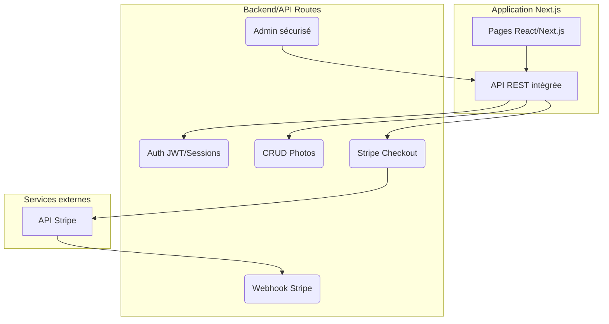

<h1 id="tp-nextjs-photos-stripe">Évaluation 2 – Développement d'une application d'achat de photos (Next.js + Stripe)</h1>

# 1 - Introduction au projet

Dans ce TP, vous allez développer une application web complète permettant à des utilisateurs de vendre et d'acheter des photos. Chaque utilisateur pourra créer un compte, gérer sa propre galerie de photos et acheter les photos mises en vente par d'autres utilisateurs.

Vous allez manipuler des services web en tant que créateur (développer une API) et consommateur (intégration d'un service tiers : Stripe).

# 2 - Objectifs pédagogiques

À la fin de ce TP, vous serez capable de :

* Développer une application web complète avec Next.js.
* Mettre en œuvre une authentification sécurisée (sessions, JWT).
* Créer et sécuriser une API RESTful intégrée à Next.js.
* Consommer un service web externe tiers (API Stripe).
* Mettre en place une documentation claire de votre API (Postman ou Swagger).

# 3 - Présentation des services web

Un **service web** est une application logicielle accessible via internet, permettant à deux systèmes de communiquer en utilisant des requêtes HTTP standardisées (GET, POST, PUT, DELETE) et en échangeant des données (JSON, XML).

Dans ce TP, vous allez utiliser deux approches des services web :

* **Création (Producteur)** : développer votre propre API REST.
* **Consommation (Consommateur)** : utiliser l’API externe Stripe.

# 4 - Table explicative – Les services web dans ce TP

| Fonction du projet                 | Type de service web  | Votre rôle            | Outils utilisés                 | Exemple concret dans le TP                             |
| ---------------------------------- | -------------------- | --------------------- | ------------------------------- | ------------------------------------------------------ |
| Authentification                   | Création             | Producteur            | Next.js API, JWT, bcrypt        | `POST /api/register`, `POST /api/login`                |
| Gestion des photos                 | Création             | Producteur            | API REST, Prisma ORM            | `POST /api/photos`, `PUT /api/photos/:id`              |
| Affichage des photos publiques     | Création             | Producteur            | API REST                        | `GET /api/photos/public`                               |
| Galerie personnelle utilisateur    | Création             | Producteur            | API REST sécurisée              | `GET /api/photos/my`                                   |
| Paiement Stripe                    | Consommation         | Consommateur          | API Stripe, Webhook Stripe      | Création session Stripe (`/api/checkout`)              |
| Traitement Webhook Stripe          | Création (récepteur) | Producteur            | API REST, Stripe SDK            | `POST /api/webhook`                                    |
| Interface d'administration (Admin) | Création             | Producteur            | API REST sécurisée (rôle admin) | `GET /api/admin/users`, `DELETE /api/admin/photos/:id` |
| Documentation API                  | Documentation        | Documenteur           | Postman ou Swagger              | Collection Postman ou Swagger `/api/docs`              |
| Sécurité des services              | Sécurisation         | Implémenteur sécurité | JWT, middleware Next.js         | Middleware (`auth.js`)                                 |

# 5 - Diagramme d'architecture du projet

# 6 - Spécifications techniques détaillées du projet

### 6.1. Fonctionnalités requises

* Authentification utilisateur complète (inscription, connexion, sessions sécurisées).
* Chaque utilisateur peut gérer (ajouter, modifier, supprimer) ses propres photos.
* Galerie publique avec photos achetables.
* Intégration complète Stripe (Checkout et Webhook).
* Galerie personnelle avec photos uploadées et achetées.
* Interface admin permettant de modérer les contenus et utilisateurs.

### 6.2. Routes API obligatoires (`app/api/...`)

| Route                | Méthode HTTP | Description                         |
| -------------------- | ------------ | ----------------------------------- |
| `/api/register`      | POST         | Inscription utilisateur             |
| `/api/login`         | POST         | Connexion utilisateur               |
| `/api/photos`        | POST         | Ajouter une photo                   |
| `/api/photos/public` | GET          | Obtenir toutes les photos publiques |
| `/api/photos/my`     | GET          | Obtenir les photos de l'utilisateur |
| `/api/photos/:id`    | PUT          | Modifier une photo                  |
| `/api/photos/:id`    | DELETE       | Supprimer une photo                 |
| `/api/checkout`      | POST         | Créer session paiement Stripe       |
| `/api/webhook`       | POST         | Traitement du webhook Stripe        |

### 6.3. Partie administration (`admin`)

| Route                   | Méthode HTTP | Description (réservé admin) |
| ----------------------- | ------------ | --------------------------- |
| `/api/admin/users`      | GET          | Liste utilisateurs          |
| `/api/admin/users/:id`  | DELETE       | Supprimer utilisateur       |
| `/api/admin/photos`     | GET          | Toutes les photos           |
| `/api/admin/photos/:id` | DELETE       | Supprimer photo             |

### 6.4. Documentation API

* Documenter vos endpoints via une collection Postman (recommandé) ou Swagger (bonus).

# 7 - Contraintes techniques imposées

* Next.js 13/14 App Router obligatoire.
* Authentification sécurisée avec JWT (NextAuth autorisé).
* ORM Prisma pour la gestion des données.
* Paiement Stripe avec gestion de Webhook sécurisé.
* Base de données au choix (SQLite, PostgreSQL).
* Interface admin protégée par vérification de rôle utilisateur.

# 8 - Livrables exigés

* Code complet sur GitHub (avec `.env.example` contenant clés Stripe en test).
* Fichier `README.md` détaillé expliquant comment installer et exécuter l'application.
* Documentation Postman ou Swagger des API.
* Démonstration fonctionnelle (vidéo courte montrant inscription, gestion photos, achat Stripe).

## Bonus possibles (facultatifs)

* Interface utilisateur responsive (TailwindCSS).
* Authentification avec OAuth (Google).
* Stockage des images via Cloudinary.
* Gestion avancée des erreurs API.

## Évaluation du TP

| Critère                                | Pondération |
| -------------------------------------- | ----------- |
| Fonctionnalités demandées              | 50 %        |
| Structure du code / Qualité / Sécurité | 20 %        |
| Documentation API                      | 10 %        |
| Interface d'administration sécurisée   | 10 %        |
| Démonstration et livrables             | 10 %        |

## Durée du TP

**Temps recommandé :** 8 à 10 heures.
**Échéance :** 2 semaines à partir de la date du cours.

**Vous pouvez débuter le TP dès maintenant. Bonne réalisation !**

Voici un texte **clair, professionnel et structuré** que tu peux remettre aux étudiants ou insérer dans ton énoncé pour expliquer la fusion des deux évaluations (Laboratoire 2 + Projet intégrateur) tout en respectant les objectifs pédagogiques distincts :

---

<h1 id="structure-evaluations-tp">Structure des évaluations – TP unique pour deux composantes du cours</h1>

Dans le cadre de ce cours, vous réaliserez un **projet unique**, mais celui-ci servira à évaluer **deux composantes distinctes** :

### 1. Laboratoire #2 – Évaluation de la **création de services web** (20 %)

Comme annoncé, le Laboratoire #2 est centré sur la **création de vos propres services web**, c’est-à-dire :

* La mise en place de votre propre API (Next.js API Routes)
* L’authentification utilisateur (register/login)
* Le développement d’un CRUD sécurisé sur les photos
* La gestion des galeries (publique et privée)
* La structuration correcte des routes RESTful
* L’interface d’administration (avec gestion des rôles)

**→ Cette partie représente la 3e activité pratique du cours.**
**→ Elle comptera pour 20 % de votre note finale.**

---

### 2. Projet final intégrateur – Création **+ consommation + documentation** (40 %)

Le **projet intégrateur** est la **suite directe** du Laboratoire 2. Il vous demandera de compléter et finaliser l'application avec :

* L’intégration complète du service externe **Stripe** (paiement en ligne)
* La gestion du Webhook Stripe (consommation entrante)
* L’attribution dynamique des photos achetées
* L’ajout de **documentation professionnelle** (Postman ou Swagger)
* La présentation finale de votre projet :

  * Code complet et fonctionnel
  * Présentation orale (5 à 10 minutes par équipe)
  * Diaporama (PPT) synthétisant le fonctionnement et les technologies utilisées

**→ Cette partie comptera pour 40 % de votre note finale.**

---

### Pourquoi un seul projet pour deux évaluations ?

Afin de garantir la cohérence pédagogique et vous éviter de développer deux projets artificiellement séparés, **vous remettrez un seul projet**. Mais :

* **Les étapes déjà terminées** (authentification, CRUD, API sécurisées, etc.) **seront évaluées pour le Laboratoire #2**
* **Les extensions fonctionnelles** (Stripe, Webhook, documentation, présentation) **seront évaluées dans le cadre du projet intégrateur**

---

### Résumé – Pondération

| Évaluation                              | Contenu évalué                                                        | Pondération |
| --------------------------------------- | --------------------------------------------------------------------- | ----------- |
| **Laboratoire #2 – Partie 3 pratique**  | Création de services web (auth, API, CRUD, admin)                     | 20 %        |
| **Projet intégrateur – Épreuve finale** | Consommation de Stripe + Webhook + documentation + présentation orale | 40 %        |

---

**Conclusion :**
Vous développez **un seul projet complet**, mais il sera évalué **en deux étapes**, chacune avec ses propres critères. Vous devez donc structurer votre travail de manière professionnelle et progressive.

Souhaites-tu aussi une version téléchargeable PDF ou Word avec mise en forme pour l’ajouter à Moodle, Lea ou Thinkific ?

